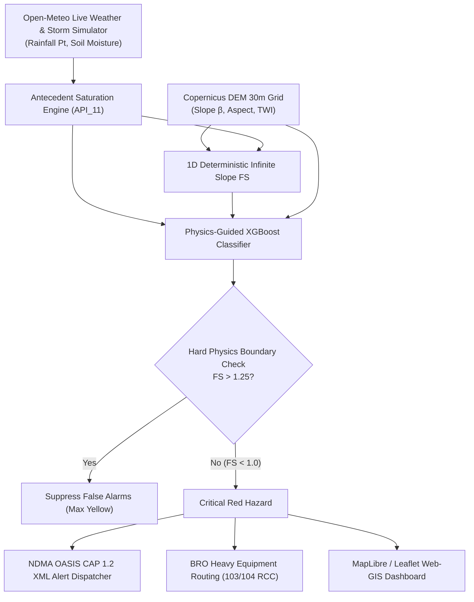

# BhoomiDrishti-NER (SIH26001 Demo System)
### AI-Based Early Warning & Landslide Risk Monitoring System in Northeast Region (NER)

[](https://fastapi.tiangolo.com)
[](https://vitejs.dev)
[](https://tailwindcss.com)
[](https://leafletjs.com)
[](https://xgboost.readthedocs.io)
[](https://docs.oasis-open.org/emergency/cap/v1.2/CAP-v1.2.html)
[](LICENSE)

---

## 📌 1. Project Overview & Corridor Focus
**BhoomiDrishti-NER** is an operational Physics-Guided Machine Learning (PGML) and Web-GIS early warning decision support platform designed for high-risk mountain highway corridors in Northeast India.

- **Primary Corridor Target:** **NH-106 (Guwahati to Shillong, Meghalaya)**
- **Spatial Coverage:** **km 40.0 to km 70.0 (Ri-Bhoi District: Nongpoh $\to$ Umsning $\to$ Barapani Pass)**
- **Spatial Discretization Resolution:** **30-meter high-density highway chainage cells (1,000 discrete sectors)**

---

## ⚡ 2. Core Scientific & Geotechnical Architecture

### A. 11-Day Antecedent Precipitation Index ($API_{11}$)
Incorporates cumulative hydrologic memory and soil moisture decay:
$$API_t = P_t + \sum_{i=1}^{11} (0.84)^i \cdot P_{t-i}$$

### B. 1D Deterministic Infinite Slope Factor of Safety ($FS$)
Evaluates mechanical regolith limit equilibrium under transient pore water pressure ($u$):
$$FS = \frac{c' + (\gamma \cdot z \cdot \cos^2\beta - u)\tan\phi'}{\gamma \cdot z \cdot \sin\beta \cdot \cos\beta}$$
- **Effective Cohesion ($c'$):** $12.0\text{ kPa}$
- **Internal Friction Angle ($\phi'$):** $28.0^\circ$
- **Saturated Regolith Unit Weight ($\gamma$):** $19.0\text{ kN/m}^3$
- **Regolith Depth ($z$):** $2.0\text{ m}$
- **Topographic Wetness Index ($TWI$):** $TWI = \ln(\alpha / \tan\beta)$

### C. Physics-Guided Machine Learning (PGML) Rule
- **Hard Geotechnical Boundary:** If $FS > 1.25$, suppress false Red/Orange alarms ($Risk \le 1$).
- **Mechanical Shear Failure Override:** If $FS < 0.95$, immediately trigger Critical Hazard ($Risk = 3$).



---

## 🚀 3. Key Modules & Features

1. **Interactive Web-GIS Highway Map:**
   - Multi-Basemap Engine (CARTO Dark Matter, CARTO Voyager Topographic, Esri Satellite, OpenStreetMap).
   - 1,000 color-coded 30m chainage segments with real-time risk choropleth (Green, Yellow, Orange, Red).
2. **Interactive 30m Longitudinal Elevation Ribbon:**
   - 420m (Nongpoh) to 1,420m (Shillong Plateau) cross-section profile with instant scrub & hover inspection.
3. **Geotechnical Inspector Drawer:**
   - Real-time Factor of Safety circular dial, $API_{11}$ decay bar chart, and geomechanical parameter breakdown.
4. **Storm Deluge & Cloudburst Simulator (Demo Centerpiece):**
   - Sliders for 0–150 mm/hr rainfall and antecedent saturation with instant corridor recalculation.
5. **NDMA SACHET / OASIS CAP 1.2 Alert Dispatcher:**
   - Standardized XML alert feed (`/api/alerts/latest.xml`) with polygon coordinates for NDMA integration.
6. **Border Roads Organisation (BRO) Staging Bay Tracker:**
   - Heavy excavator bases at Nongpoh (103 RCC), Umsning (104 RCC), and Barapani Outpost with clearance ETAs.
7. **Citizen Field Crowdsource PWA:**
   - Edge-AI tension crack detection with spatial DBSCAN hotspot clustering.

---

## 🛠️ 4. Quickstart Guide

### Prerequisites
- Python 3.10+
- Node.js 18+ and npm

### Installation & Execution (One Command)
```bash
# 1. Clone repository
git clone https://github.com/Sabarish-20/BhoomiDrishtri-NER-Landslide-Monitoring-System.git
cd BhoomiDrishtri-NER-Landslide-Monitoring-System

# 2. Setup Python virtual environment
python3 -m venv backend/venv
source backend/venv/bin/activate
pip install -r backend/requirements.txt

# 3. Build frontend
cd frontend
npm install
npm run build
cd ..

# 4. Launch unified server
python backend/run_server.py
```

Open your browser at **`http://localhost:8000/`**.

---

## 🧪 5. Running Automated Tests

```bash
PYTHONPATH=. ./backend/venv/bin/pytest backend/tests/test_backend.py -v
```

All 8 test suites validate physics formulas, PGML boundary constraints, CAP 1.2 XML schemas, DBSCAN clustering, and FastAPI endpoints.

---

## 📡 6. API Reference

| Method | Endpoint | Description |
|---|---|---|
| `GET` | `/health` | System health check & 1,000 cells confirmation |
| `GET` | `/api/corridor/grid` | GeoJSON of 30m cells with live FS & PGML risk |
| `GET` | `/api/weather/current` | Real-time Open-Meteo telemetry or simulation state |
| `POST` | `/api/simulation/trigger-storm` | Trigger synthetic cloudburst (up to 150 mm/hr) |
| `POST` | `/api/simulation/reset` | Revert to live weather |
| `GET` | `/api/alerts/latest.xml` | Raw OASIS CAP 1.2 XML for NDMA SACHET Gateway |
| `GET` | `/api/alerts/active` | Active emergency alerts list |
| `POST` | `/api/crowdsource/report` | Submit citizen crack report |
| `GET` | `/api/crowdsource/clusters` | DBSCAN spatial hotspot clusters |
| `GET` | `/api/logistics/depots` | BRO equipment depots & machinery status |
| `GET` | `/api/logistics/dispatch` | Route dispatch & clearance ETA calculator |

---

## 📄 License
Licensed under the [MIT License](LICENSE).
